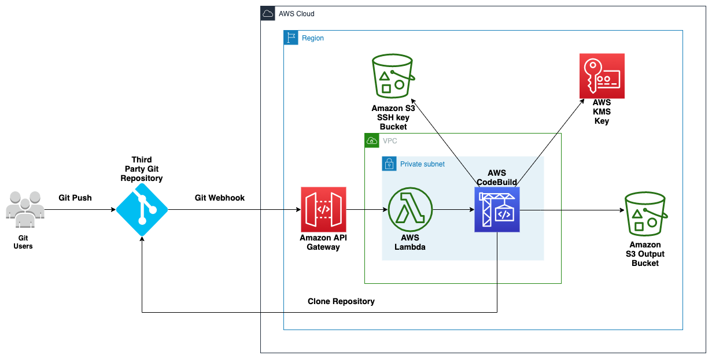

## Git webhooks with AWS services - Quick Start

For architectural details, step-by-step instructions, and customization options, see the [deployment guide](https://fwd.aws/6e9Rd).
 

The Quick Start includes an AWS CloudFormation template that automates the deployment. You can also use the AWS CloudFormation template as a starting point for your own implementation.

